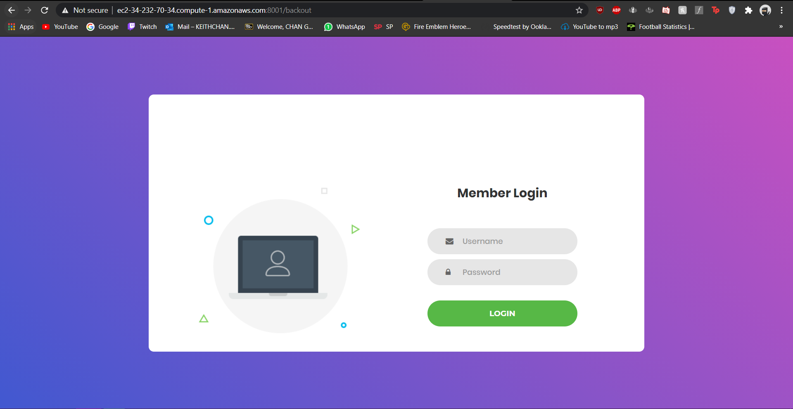
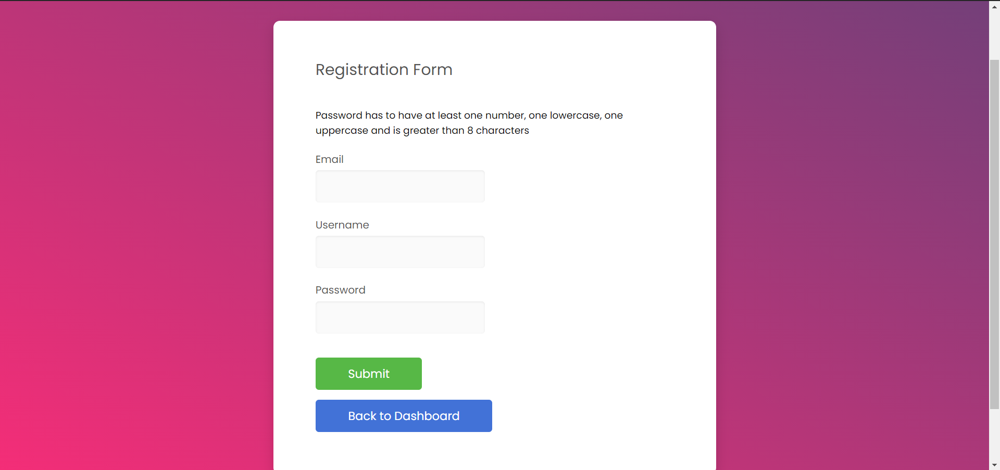
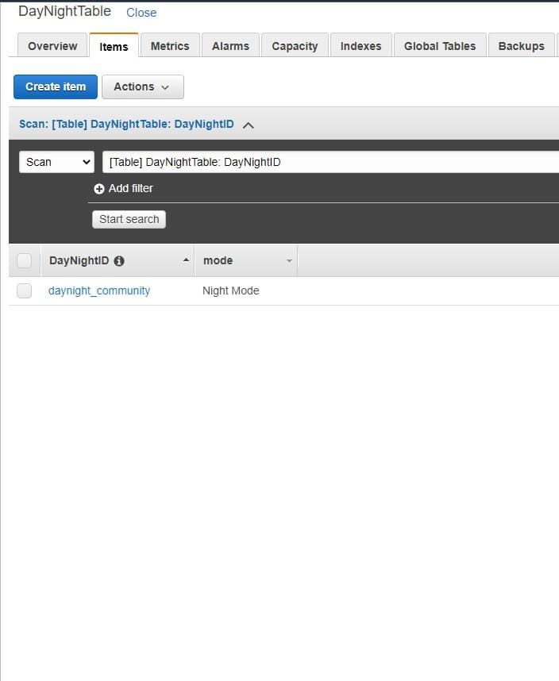
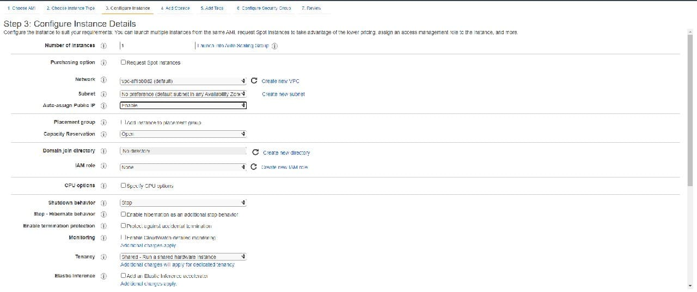

# community_home
**What is this application about:**  
This application is a smart home setup. This setup can be used on lights, open doors and using a recognised license plate to open the garage door. When a car heads up towards the garage, our pi cam will use facial recoknise and identify the license plate number, based on the license plate, the garage door will open. All of the features in the smart home can be controlled using the number pad. We have a password authentication as well, so that we can identify and authenticate the owner of the house. A DHT11 sensor to record temperature and humidity values real time. Our target audience is the public. The target audience could use our setup as a way of convienience and obtain information about the house.   

**RPI hardware set-up**:  
  

**Steps(Hardware):**  
1) Create the code for smarthome.py
2) Replicate the code from the code file in this github repository known as smarthome.py  

**Steps(web application):**  
1) Creation of server page using the code uploaded in github known as server.py  

Here is the image of how the **server** should be run using EC2:  
  

2) Creation of login page using the code uploaded in github known as login.html

Here is the image of how the **login page** should look like after you use our code in github:  
  

3) Creation of index page using the code uploaded in github known as index.html  

Here is the image of how the **index** should look like after you use our code in github:  
  
  

4) Creation of light page using the code uploaded in github known as lights.html  

Here is how the **light page** should look like after you have use our code in github:  
  

5) Creation of temperature page using the code uploaded in github known as temperature.html  

Here is how the **temperature page** should look like after you have use our code in github:  
  

6) Creation of add user page using the code uploaded in github known as register.html  

Here is the image of how the **register page** should look like after you use our code in github:  

7) Creation of add license plate page using the code uploaded in github known as addlicense.html  

Here is the image of how the **addlicense page** should look like after you use our code in github:  

8) Creation of the delete user page using the code uploaded in github known as deleteuser.html  

Here is the image of how the **delete user page** should look like after you use our code in github:  

9) Creation of the delete license plate page using the code uploaded in github known as deletelicense.html  

Here is the image of how the **delete license plate** page should look like after you use our code in github:  
  

**Creation of AWS services:**  
1) DynamoDB
2) EC2
3) Amazon Rekognition and S3
4) IOT core  

**Creation of DynamoDB:**  
1) Head to AWS DynamoDB and on the left navigation pane click "Tables"   
2) Click "Create table"  
3) Fill in the fields accordingly  
  
4) Click on "Create"  
5) Follow the same steps and create the other tables  
  
  
  
  
  

**Creation of EC2:**
1) Head into EC2 and launch an instance  
  
2) Click on launch instance and you will be greeted with the choose amazon machine page  
  
3) Click on select for the first option in the image shown and you will be able choose your instance type  
  
4) Click on the option in the image and click on next and you will be able to configure the instance details  
  
  
5) Fill in all the necessary details and click on next
6) Next will be adding a storage  
  
7) Fill in necessary details and click on next then you will be greeted with the add tags page  
  
8) Fill in the necessary details and click on next. You will be greeted with the configure security page  
  
9) Click on next  
10) On the last page, just review the settings and launch the EC2 instance  

**Amazon Rekognition and S3**  
1) Click on the amazon s3 services  
2) Create a new bucket  
  
3) Click on create bucket  
4) You will be greeted with a bucket setup page  
  
  
5) Click on Create Bucket  
6) Regarding the facial rekognition feature, use the created bucket to store the image taken from the picamera and it will recognise what is the license plate  
  

**IOT CORE**  
1) Click on IOT core  
2) On the left pane click on Act followed by rules in the dropdown  
3) Once in the rules page, click on "Create"  
  
4) You will be greeted with the create rule page  
  
5) Fill in the necessary details and click on add action  
  
6) You will be greeted with a list of actions. Select the split message into multiple columns of a DynamoDB table action.  
  
7) Click on "Configure action" once you are done  
  
8) Click on "Create Rule"  
  

**Steps to run the program**  
1) Open WinSCP  
2) Connect to EC2 server  
3) Ctrl+P to open PuTTY  
4) Navigate to server.py folder in EC2  
5) In command prompt type "python3.8 server.py" and run the code  
6) Server will be launched  
  
7) Open VNC viewer  
8) Connect to RPI  
9) RUN smarthome.py on command prompt in RPI  
  
